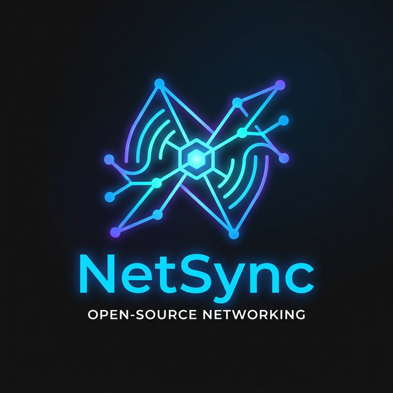

# NetSync V2

<div align="center">
  
</div>

*[Read in English](README.md)*

Kerangka kerja (framework) jaringan berperforma tinggi dengan tipe data ketat (*strict-typing*) untuk Roblox. NetSync V2 sepenuhnya meninggalkan tabel data tradisional dan berpindah ke **zero-allocation binary buffer serialization**, menciptakan lingkungan super cepat dan aman untuk menangani ribuan pengiriman per detik.

## Fitur Utama
- **Skema Jaringan Ketat:** Berbagai *Packet* data harus didefinisikan secara konkrit (seperti U8, F32, Array, Struct). Ini memusnahkan transmisi Tabel Lua di dalam jaringan.
- **Zero-Allocation Buffers:** Menulis dan membaca data biner di atas satu Buffer berkelanjutan tanpa memicu *Garbage Collection Spikes*.
- **Payload Batching:** Mengantrekan seluruh panggilan `Fire` dan memempatkannya dalam satu paket masif di setiap pergantian *frame* via `RunService.Heartbeat`.
- **Advanced Hash Generation:** Menggunakan algoritma hash 32-bit FNV-1a secara otomatis sebagai pengganti teks panjang, menjamin tidak ada tumpang-tindih (*zero collisions*).
- **Anti Eksploitasi & Anti DDoS:** Terlindungi lewat sistem *Rate Limiting* di sisi server, penjagaan ketat pada batas string (Maks 65535 byte), pengamanan *pcall* yang absolut, dan pelompatan aman (*safe skip*) terhadap korupsi data.

## Penggunaan & API

### 1. Instalasi
Unduh file `NetSync.rbxm` terbaru dari tab **Releases** dan letakkan ke dalam `ReplicatedStorage`, atau gunakan plugin sinkronisasi **Rojo** untuk memuat repositori ini ke studi Anda.

```json
"NetSync": {
  "$path": "path/to/NetSync/src"
}
```

### 2. Mendefinisikan Skema (*Schema*)
Tidak seperti `RemoteEvent` biasa, Anda diwajibkan menjabarkan secara rapi seperti apa wujud data Anda sebelum digencet menjadi bits biner.

```lua
local ReplicatedStorage = game:GetService("ReplicatedStorage")
local NetSync = require(ReplicatedStorage:WaitForChild("NetSync"))

local PlayerDamageSchema = NetSync.Types.Struct({
    TargetId = NetSync.Types.U32,      
    Damage = NetSync.Types.F32,        
    IsCritical = NetSync.Types.Boolean,
    WeaponType = NetSync.Types.String  
})

-- Mendaftarkan Packet
local DamagePacket = NetSync.Packet("DamagePlayer", PlayerDamageSchema)
```

### 3. Sisi Server
```lua
-- Opsional: Konfigurasi batas permintaan spam (Default: 200 tembakan per detik, Hukuman Drop)
NetSync.ConfigureRateLimit({
    MaxRequestsPerSecond = 200,
    Punishment = "Drop" -- "Drop" | "Kick"
})

-- Mendengarkan Sinyal yang masuk
local disconnect = DamagePacket.Listen(function(player, data)
    print(`Menerima damage: {data.Damage} dari {player.Name}`)
    -- Menembak kembali peluru jaringan ke klien tersebut
    DamagePacket.FireClient(player, data)
end)

-- Untuk mencegah memory leak pada sistem jangka panjang:
-- disconnect() 
```

### 4. Sisi Client
```lua
-- Mendengarkan Event dari Server
DamagePacket.Listen(function(player, data)
    -- Di Client, argumen pertama 'player' akan memuat 'data' itu sendiri
    -- Lebih dianjurkan menangani nilainya menggunakan logika amannya di NetSync_Tutorial.luau
    print(`Server mengonfirmasi hit!`)
end)

-- Menembakkan Sinyal (Akan di antre dan dikirim saat Heartbeat)
DamagePacket.FireServer({
    TargetId = 1234567,
    Damage = 45.2,
    IsCritical = true,
    WeaponType = "Excalibur"
})
```

## Tipe Skema yang Tersedia (`NetSync.Types`)
- `U8`, `U16`, `U32` (Integer Tak Bertanda / Nol ke Atas)
- `I8`, `I16`, `I32` (Integer Bertanda / Minus ke Atas)
- `F32`, `F64` (Bisa menampung angka Desimal)
- `Boolean`
- `String` (Batas memori dinamis maksimum 65535 byte)
- `Vector3`
- `CFrame`
- `Array(Tipe_Data_Di_Dalamnya)`
- `Struct({ [string] = Tipe_Data_Di_Dalamnya })`
